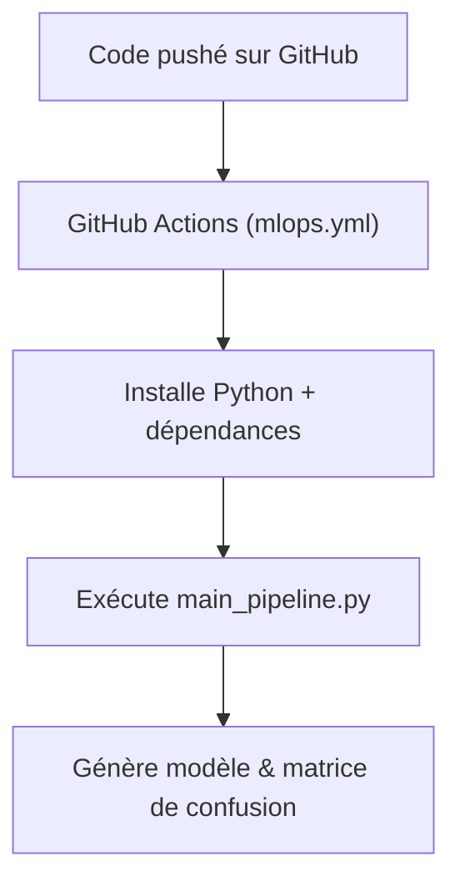

#  MNIST Classification – Projet Deep Learning


Projet étudiant visant à entraîner et comparer deux modèles de classification (MLP et CNN) sur la base MNIST, et à les déployer via une API FastAPI et une interface utilisateur Streamlit. Le tout est conteneurisé avec Docker.

---

##  Sommaire
1. [Objectif](#1-objectif)
2. [Structure du projet](#2-structure-du-projet)
3. [Préparation des données](#3-préparation-des-données)
4. [Architecture des modèles](#4-architecture-des-modèles)
5. [Entraînement du modèle](#5-entrainement-du-modèle)
6. [Sauvegarde du modèle](#6-sauvegarde-du-modèle)
7. [API avec FastAPI](#7-api-avec-fastapi)
8. [Frontend avec Streamlit](#8-frontend-avec-streamlit)
9. [Dockerisation](#9-dockerisation)
10. [Tests](#10-tests)
11. [Conclusion](#11-conclusion)
12. [Lancement](#12-lancement)
13. [Automatisation & Pipeline](#13-automatisation--pipeline)
14. [CI/CD avec GitHub Actions](#14-cicd-avec-github-actions)
15. [Bilan MLOps](#15-bilan-mlops)


---

## 1. Objectif

L’objectif est de comparer deux architectures de modèles (MLP et CNN), d’explorer l’effet de permutations aléatoires des pixels, de mettre en place une API d’inférence et de proposer une interface web de prédiction de chiffres manuscrits dessinés en temps réel.

---
## 2 Structure du projet

```bash
.
├── .gitignore
├── README.md
├── data
│   └── raw
│       └── MNIST
│           └── raw
│               ├── t10k-images-idx3-ubyte
│               ├── t10k-images-idx3-ubyte.gz
│               ├── t10k-labels-idx1-ubyte
│               ├── t10k-labels-idx1-ubyte.gz
│               ├── train-images-idx3-ubyte
│               ├── train-images-idx3-ubyte.gz
│               ├── train-labels-idx1-ubyte
│               └── train-labels-idx1-ubyte.gz
├── mnist_project
│   ├── Dockerfile.api
│   ├── Dockerfile.front
│   ├── data
│   │   └── MNIST
│   │       └── raw
│   │           ├── t10k-images-idx3-ubyte
│   │           ├── t10k-images-idx3-ubyte.gz
│   │           ├── t10k-labels-idx1-ubyte
│   │           ├── t10k-labels-idx1-ubyte.gz
│   │           ├── train-images-idx3-ubyte
│   │           ├── train-images-idx3-ubyte.gz
│   │           ├── train-labels-idx1-ubyte
│   │           └── train-labels-idx1-ubyte.gz
│   ├── docker-compose.yml
│   ├── model
│   ├── notebook
│   │   ├── 01_mnist_exploration.py
│   │   ├── generate_image.py
│   │   ├── test_convnet.py
│   │   ├── test_mlp.py
│   │   └── test_predict.py
│   ├── requirements.txt
│   ├── src
│   │   ├── app
│   │   │   ├── main.py
│   │   │   └── streamlit_app.py
│   │   └── model
│   │       ├── convnet.py
│   │       ├── mlp.py
│   │       └── train.py
│   └── test_images
│       ├── 0.png
│       ├── 1.png
│       ├── 2.png
│       ├── 3.png
│       ├── 4.png
│       ├── 5.png
│       ├── 6.png
│       ├── 7.png
│       ├── 8.png
│       └── 9.png
├── structure.txt
└── torch-2.2.2-cp310-none-macosx_11_0_arm64.whl

15 directories, 69 files

```

## 3. Préparation des données

Le dataset MNIST est téléchargé avec `torchvision.datasets.MNIST`. Un prétraitement est appliqué :

```python
transforms.Compose([
    transforms.ToTensor(),
    transforms.Normalize((0.1307,), (0.3081,))
])
```

Dans certains cas, des augmentations sont ajoutées pour rendre le modèle plus robuste aux variations manuscrites :

```python
transforms.RandomAffine(degrees=25, translate=(0.2, 0.2), shear=15)
transforms.RandomPerspective(distortion_scale=0.3, p=0.5)
```

---

## 4. Architecture des modèles

### 4.1. MLP (Multilayer Perceptron)

Le modèle MLP est défini avec 3 couches linéaires et des activations ReLU intermédiaires. Il est entraîné sur les pixels aplatis (28×28).

### 4.2. CNN (Convolutional Neural Network)

Un modèle convolutionnel simple est défini dans `convnet.py`, avec 2 couches `Conv2d`, des activations ReLU, du `MaxPool2d` et une couche fully connected finale.

---

## 5. Entraînement du modèle

L’entraînement est réalisé dans `train.py`. La fonction `train()` applique :

- mise en mode `train()`
- calcul de la loss `F.cross_entropy`
- propagation arrière (`loss.backward()`)
- update avec `optimizer.step()`

Une permutation de pixels peut être appliquée avec `perm = torch.randperm(784)`, ce qui perturbe fortement les modèles, sauf pour le MLP.

La fonction `test()` permet de mesurer la `test_loss` et l’`accuracy`.

### Remarques :

- Le CNN est bien plus performant qu’un MLP sur des images structurées.
- En cas de permutation aléatoire, les CNN perdent leur avantage (perdent la spatialité), contrairement aux MLP.
- Une augmentation des données améliore les performances de généralisation sur des chiffres dessinés à la main.

---

## 6. Sauvegarde du modèle

Le modèle est sauvegardé dans `model/mnist-0.0.1.pt` avec :

```python
torch.save(model.state_dict(), "model/mnist-0.0.1.pt")
```

---

## 7. API avec FastAPI

Une API est exposée dans `main.py` via FastAPI :

- `POST /api/v1/predict` prend en entrée un fichier image PNG
- Convertit l’image en tenseur normalisé 28×28
- Prédit la classe avec le modèle CNN pré-entraîné

---

## 8. Frontend avec Streamlit

L’interface graphique Streamlit permet :

- De dessiner un chiffre dans une zone de dessin (canvas)
- De visualiser l’image 28×28 envoyée à l’API
- D’afficher la prédiction retournée

Traitement appliqué sur l’image dessinée :

- Inversion des couleurs (dessin blanc sur fond noir)
- Resize à 28×28
- Sauvegarde PNG temporaire pour appel API

---

## 9. Dockerisation

Deux Dockerfiles sont créés :

- `Dockerfile.api` pour le backend FastAPI
- `Dockerfile.front` pour le frontend Streamlit

Un `docker-compose.yml` permet de lancer le projet complet avec :

```bash
docker compose up --build
```

---

## 10. Tests

Des tests d’image sont faits avec :

- Des images extraites de MNIST (via script matplotlib)
- Des chiffres dessinés manuellement avec la souris

On observe que :

- Les prédictions sur des images dessinées à la main sont correctes uniquement si l'entraînement a été fait avec des augmentations réalistes
- Le CNN bien entraîné atteint >98% de précision sur MNIST et fonctionne bien sur les dessins

---

## 11. Conclusion

Ce projet illustre l’intérêt des réseaux de neurones convolutionnels pour la classification d’images structurées. Il montre aussi comment entraîner, sauvegarder et déployer un modèle en production à travers une API REST et une interface web simple.

Points clés :

- Le MLP est plus robuste aux permutations aléatoires
- Le CNN tire profit de la structure spatiale de l’image
- La mise en production nécessite une standardisation de l’entrée
- L’ajout d’augmentations (affine, perspective) est crucial pour généraliser

---

## 12 Lancement

Une fois Docker installé :

```bash
docker compose up --build
```

Puis ouvrir [http://localhost:8501](http://localhost:8501)

## 13. Automatisation & Pipeline (MLOps Niveau 1)

Afin de rendre l’entraînement et l’évaluation reproductibles et industrialisables, un script `main_pipeline.py` a été mis en place. Il permet d’enchaîner automatiquement les étapes suivantes :

- Chargement des données MNIST
- Prétraitement (normalisation)
- Initialisation du modèle (CNN ou MLP)
- Entraînement
- Évaluation (accuracy + confusion matrix)
- Sauvegarde du modèle entraîné

L’exécution est automatisée via le fichier `run.sh`, avec le choix du modèle en paramètre :

```bash
bash run.sh cnn
```
## 14. CI/CD avec GitHub Actions

Un pipeline d'intégration continue a été mis en place via GitHub Actions.

Il repose sur le fichier `.github/workflows/mlops.yml` qui automatise les étapes suivantes à chaque `push` ou `pull_request` sur la branche `main` :
- Installation de Python 3.10
- Installation des dépendances (`requirements.txt`)
- Exécution du script `main_pipeline.py` avec le modèle CNN
- Vérification de la présence du fichier modèle (`model/mnist_cnn.pt`)

###  Rôle des composants

- `main_pipeline.py` : le cœur du pipeline ML (entraîne/teste un modèle)
- `run.sh` : script local simple pour exécuter le pipeline en MLP ou CNN
- `.github/workflows/mlops.yml` : automate GitHub qui exécute le pipeline à chaque modification de code

---

###  Diagramme de relation


## 15. Bilan MLOps

Ce projet constitue une mise en œuvre complète d'un **pipeline MLOps Niveau 1**, selon les bonnes pratiques de production de modèles ML :

-  **Pipeline ML reproductible** via `main_pipeline.py`
-  **Exécution automatisée** locale avec `run.sh`
-  **CI/CD fonctionnel** grâce à `.github/workflows/mlops.yml` (GitHub Actions)
-  **Comparaison de deux architectures** (MLP vs CNN)
- **Dockerisation complète** avec `docker-compose`
-  **Modèle sauvegardé automatiquement** à chaque exécution (`model/mnist_*.pt`)
-  **Évaluation visuelle** avec matrice de confusion
-  **Reproductibilité assurée** sur n’importe quelle machine (via GitHub Actions ou Docker)

 Ce projet prouve la capacité à passer d’un script ML exploratoire à une version industrialisable et automatisée, conforme aux exigences du **niveau MLOps 1**.
